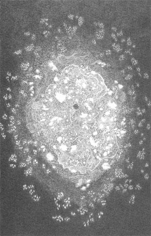

# Setting up a Typesetting system

The current workflow uses:

- Pandoc (<https://pandoc.org/installing.html>, v. 3.1.11.1),
- \LaTeX (or, actually, xelatex) (<https://www.latex-project.org/get/>),
- makefiles (that are native to Unix systems, but can be ported in windows using [Cygwin](https://cygwin.com/install.html))
- the Symbola font (you can find it at <https://web.archive.org/web/20180307013123/http://users.teilar.gr/~g1951d/Symbola.zip>)^[Starting [with version 11](http://web.archive.org/web/20181228102842/http://users.teilar.gr/%7Eg1951d/Symbola.pdf), the licence is too restrictive for non-personal use.
As a consequence, users are asked to make sure they do not use a version greater than v.10.24, which is "free for any use" and [archived on-line](http://web.archive.org/web/20180307012615/http://users.teilar.gr/~g1951d/Symbola.zip) (curious users can also refer to [the related webpage](http://web.archive.org/web/20180307012615/http://users.teilar.gr/~g1951d/)).
Note that installing this dependency using a unix-like package manager will result in installing a version of the font that [is free to use in any context](https://metadata.ftp-master.debian.org/changelogs//main/t/ttf-ancient-fonts/ttf-ancient-fonts_2.60-1.1_copyright).]
- [entr](https://github.com/eradman/entr) (optional)^[This program allows to use `make watch` to automatically re-compile `main.md` into `main.pdf` whenever `main.md` is modified (that is, edited and saved).]


The typical file hierarchy is:

```
├── bib
│   └── bib.bib
├── img
├── info.md
├── main.md
├── makefile
└── templates
    ├── head.tex
    └── theoretical-computer-science.csl
```

Where

- `bib.bib` is a file containing references, using the [bibtex](http://www.bibtex.org/) formatting, often used with \LaTeX.
- `img/` contains potential images loaded in the main document,
- `info.md` contains some meta-data and instructions for the formatting (they could be in `main.md` as well, it is just to keep that later file as small as possible, and to be able to re-use this templating easily),
- `makefile` gives instructions on how to generate `.tex` and `.pdf` files from `main.md`, using commands such as

    ```
    pandoc --pdf-engine=xelatex --metadata-file=info.md \
        --citeproc -M date="`date "+%B %e, %Y"`" \
        --include-in-header templates/head.tex $< -o $@
    ```
    
    that means:
    
    - Tell pandoc to process main.md (the `$<` parameter, which denotes in makefile the source we need to construct what we are constructing),
    - using XeLaTeX as the pdf engine,
    - using info.md for the metadatas,
    - using citeproc (which is a filter that process the bibliographical references),
    - setting the date to be the value returned by the command `date "+%B %e, %Y"` (so, the current date, formatted nicely),
    - including in the header the file `templates/head.tex`
    - and outputting into a file called main.pdf (the `$@` parameter, which denotes in makefile what we are constructing).
    
- `templates/head.tex` contains some \LaTeX tweaking (primarily about the sections, some unicode characters and the appareance of the links),
- `templates/theoretical-computer-science.csl` is the [Citation Style Language](https://citationstyles.org/) file, that explains how references should be displayed. Since this is very field-sensitive, many different formatting exist, and we pick the one for theoretical computer science.


**Important**: Note that this details the organization of _the current folder_ (exercises_0) but that the overall repository is organized a bit differently, to avoid duplicating the bib and template files.

# Examples

Here is a reference [@Aubert2019], and here is an image, courtesy of [Jérôme Minard](http://jeromeminard.com/projects/monde-miroir/):



# References
