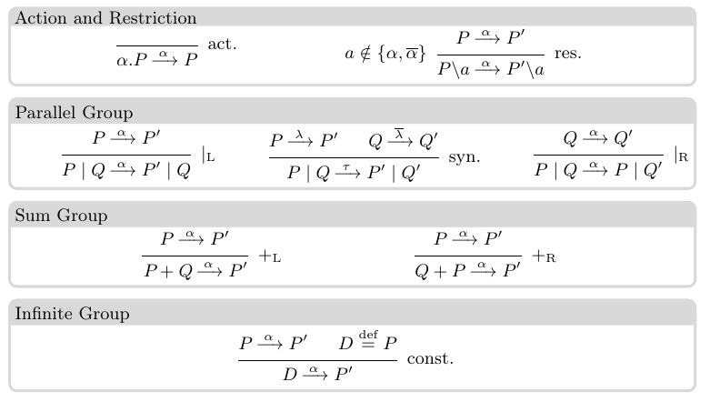

# Forward-Only CCS

## Syntax

The syntax of the Calculus of Communicating Systems (CCS) is given e.g. at <https://en.wikipedia.org/wiki/Calculus_of_communicating_systems#Syntax>.
We summarize it below.

(Co-)names and labels
~ 
    Let $\mathsf{N}=\{a,b,c,\dots\}$ be a set of \emph{names} and $\overline{\mathsf{N}}=\{\overline{a},\overline{b},\overline{c},\dots\}$ its set of \emph{co-names}.
	The set of \emph{labels} $\mathsf{L}$ is $\mathsf{N} \cup \overline{\mathsf{N}} \cup\{\tau\}$, and we use $\alpha$, $\beta$ (resp.  $\lambda$) to range over $\mathsf{L}$ (resp.  $\mathsf{L} \backslash \{\tau\}$).
	A bijection $\overline{\cdot}:\mathsf{N} \to \overline{\mathsf{N}}$, whose inverse is also written $\overline{\cdot}$, 
	gives the \emph{complement} of a name.
	
The intuition is that a channel (which can be a name or a co-name) represents a port, a slot, a button, a switch….
A name represents the action of sending an input along that channel, and a co-name represents the action of receiving an input along that channel.
Names and co-names are *complement* because receiving an input on $\overline{a}$ suppose that a message was output on $a$.

CCS is not interested with the content of the messages that are exchanged: they are treated as black boxes.
It only cares about the possibility of *processes* (read: computers, threads, agents, …) interacting.

Processes are then constructed in the following way:

$$P, Q ::= 0 ~\|~ \alpha.P ~\|~ P + Q ~\|~ P | Q ~\|~ P[\alpha/\beta] ~\|~ P \backslash \alpha ~\|~ A$$

meaning that

- $0$ (the inactive process) is a process,
- $\alpha.P$ is the process that can send (or receive) along $\alpha$ and then continue as $P$,
- $P + Q$ is a process that can act as $P$ (exclusive) or as $Q$,
- $P | Q$ is the process that results from setting in parallel $P$ and $Q$,
- $P[\alpha/\beta]$ is the process that results from replacing every occurrence of $\alpha$ by $\beta$ in $P$,
- $P \backslash \lambda$ is the process $P$ where the channel $\lambda$ is kept private (that is, it can use it only to exchange messages internally),
- $A \overset{\underset{\mathrm{def}}{}}{=} P$  uses the identifier $A$ to refer to the process $P$ (which may contain the identifier $A$).

This recursive definition, along with replication and recursion, is one of the mechanism in CCS used to represent infinite behaviours.

Exercise:
~ Usually, we simplify the notation by assuming some convention [@Degano2003]. We do not write "trailing $0$", so that $a.0$ is the same as $a$, and:

    > We assume that the operators have decreasing binding power, in the following order: $\backslash \alpha, \alpha., |, +$.
    
    Explain the meaning of this (slightly modified) quote, and write down the parenthesised version of a couple of terms without parenthesises.
    For instance, is $a + b | c$ the same as $(a + b) | c$, or the same as $a + (b | c)$? Is $A + a . a | b + c$ the same as $A + ((a.a)|(b+c))$, or is it something else entirely?
    
## Semantics

The processes are then given a _semantics_ (a way of _reducing_, of being executed) thanks to a labeled transition system (LTS), given in \autoref{fig:semantics}.

This means that to decide, for instance, if $a.P + Q \backslash b$ can become $P$, we have to find a _derivation_ using those rules.
In this case, we can (almost!) construct it:

- $a.P$ can use the act.\ rule to become $P$,
- as a consequence, $a.P + Q$ can use the $+_{\text{L}}$ rule to become $P$,
- as a consequence, and since $b \notin \{a, \overline{a}\}$,  $a.P + Q \backslash b$ (which is the same as $(a.P + Q)\backslash b$) can use the res.\ rule to become … $P \backslash b$.

Summarizing, $a.P + Q \backslash b \xrightarrow{a} P \backslash b$, which means that $a.P + Q \backslash b$ can become $P$ once it received a message on $a$.
Note that if we had $a = b$, then the process $a.P$ would be stuck: to make progress, it would have te receive a message on $a$ "from the outside world", but this is not possible because of the restriction: this is what the side condition in the res.\ rule guarantee.

Exercise:
~ In forward-only CCS, list all the different reductions that $c.(\overline{a} | (b. a | d ))$ can perform to reach $0 | (0 | 0)$.

Exercise:
~ (Inspired from [@Milner1989]) Assuming that $a \neq b$, write the derivation of the transitions:
    
    \begin{align*}
    (a.P + b.0) | \overline{a}.Q  & →^{a} P | \overline{a}.Q \\
    (a.P + b.0) | \overline{a}.Q  & →^{\overline{a}} (a.P + b.0) | Q \\
    (a.P + b.0) | a.Q & →^{b} 0 | a.Q \\
    ((a.P + b.0) | a.Q)\backslash a &  →^{b} (0 | a.Q) \backslash a\\
    (a.P | Q) \backslash b | (\overline{a}.Q' \backslash c) & →^{\tau} (P |Q) \backslash b | (Q' \backslash c)
    \end{align*}

# Vending Machine

Next page is presented the "canonical example" from [@Milner1989, p. 23] (note that the $V$ at the right of the equation are here to trigger recursion).

# References
