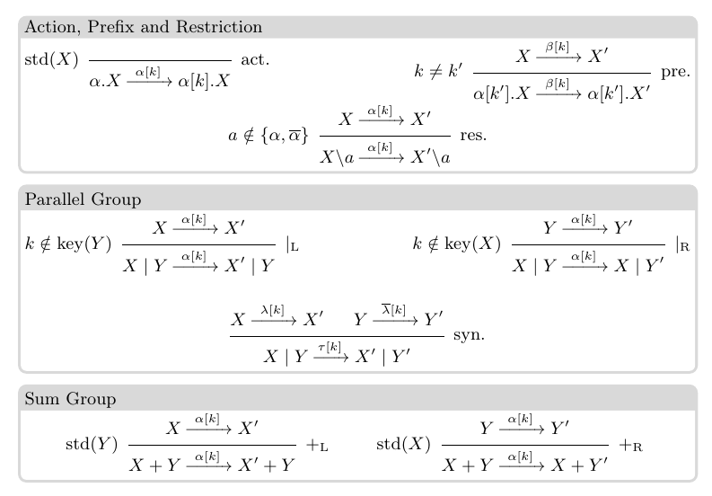

# CCS with Keys

## Syntax & Semantics

Processes in CSSk are exactly the same as CCS processes, with three exceptions:

- They are denoted by $X$, $Y$ instead of $P$, $Q$ (this is just a convention, and we will keep on using $P$ and $Q$ to denote CCS processes),
- They can contain "keyed prefixes" $\alpha[k].X$, which represent "past actions",
- They generally do not include operators to represent infinite behaviours such as recursion, replication or iteration.

$$X, Y ::= 0 ~\|~ \alpha.X ~\|~ X + Y ~\|~ X | Y ~\|~ X[\alpha/\beta] ~\|~ X \backslash \alpha ~\|~ \alpha[k].X$$

The operator $\alpha[k].X$ marks that the channel $\alpha$ was already used, and tags it with the key $k$.

Standard and reachable processes:
~ 

	The set of keys occurring in $X$, $\text{key}(X)$, is defined inductively:
	\begin{align*}
		\text{key}(0) & = \emptyset  &&& \text{key}(X + Y) &= \text{key}(X) \cup \text{key}(Y) \\
		\text{key}(\alpha.X) & = \text{key}(X) &&& \text{key}(X | Y) &= \text{key}(X) \cup \text{key}(Y) \\
		\text{key}(\alpha[k].X) & = \{k\} \cup \text{key}(X) 
	\end{align*}
	We say that $X$ is _standard_ and write $\text{std}(X)$ iff $\text{key}(X) = \emptyset$---that is, if $X$ is a CCS process.

Exercise:
~  
    For each of the processes below, decide if they are standard, and if they are not, write their set of keys.
    
    - $a[k].b | \overline{b}$
    - $a | b.c$
    - $(b[k].\overline{c} + a) | (c + \overline{b})$
    - $(a[k].c[k']) | (\overline{a}[k] . d)$
	
CSSK has *two* LTSes: one for the forward transitions, given in \autoref{fig:sem}, and one for the reverse transitions.



Exercise:
~  Write the term you would obtain in CCSK for each of the transition listed in the last exercise of the previous exercise sheet.

The LTS for the reverse transitions (denoted $\rightsquigarrow$, or, in ASCII notation, `~~~>`) is the exact symmetric of the one given in \autoref{fig:sem}. That is, for every rule

```
X ---a---> Y
------------
X' --a---> Y'
```

, there is  a rule

```
Y ~~a~~> Y
-------------
Y' ~~a~~> X'
```
Exercise:
~ 
    Write the reverse LTS for CCSK.


Exercise:
~ Write all of the forward and backward transitions that the following processes can perform:

    - $a[k].b | \overline{b}$
    - $(b[k].\overline{c} + a) | (c + \overline{b})$
    - $(a[k].c[k']) | (\overline{a}[k] . d)$
    
Exercise:
~ Looking back at the vending machine example from the previous exercise sheet, explain intuitively why $1p.1p.big.collect.V + 1p.little.collect.V$ could be an ok way of answering exercise 4 in a reversible system, and why this process would not fulfill the requirement of exercise 4 in a non-reversible set-up.
